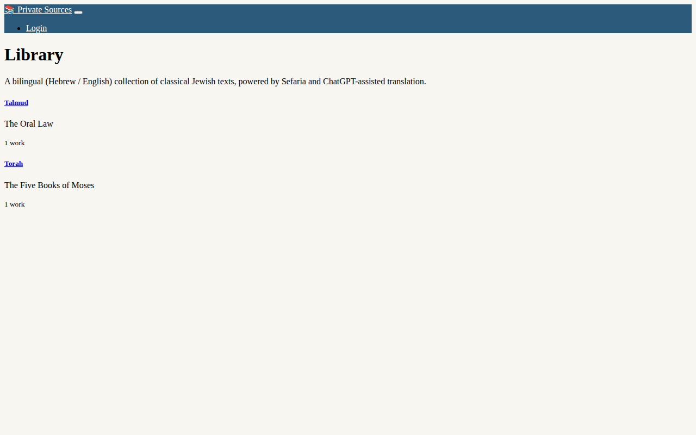
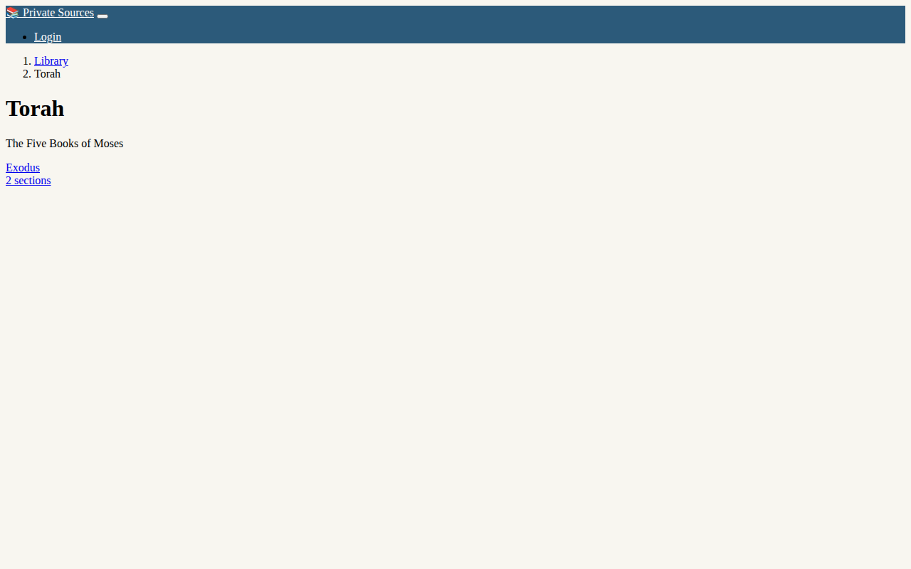
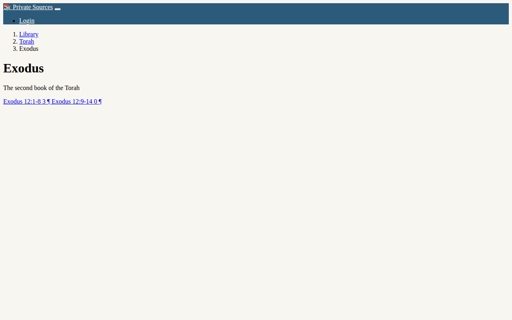
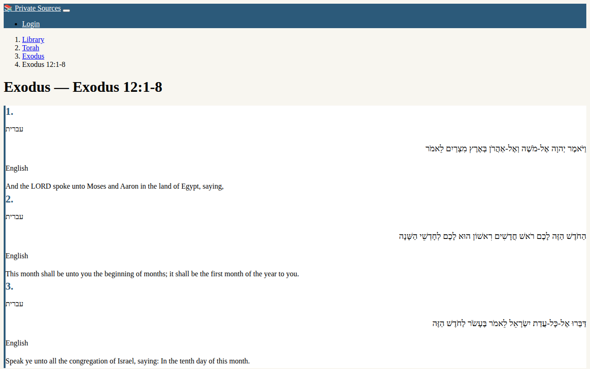
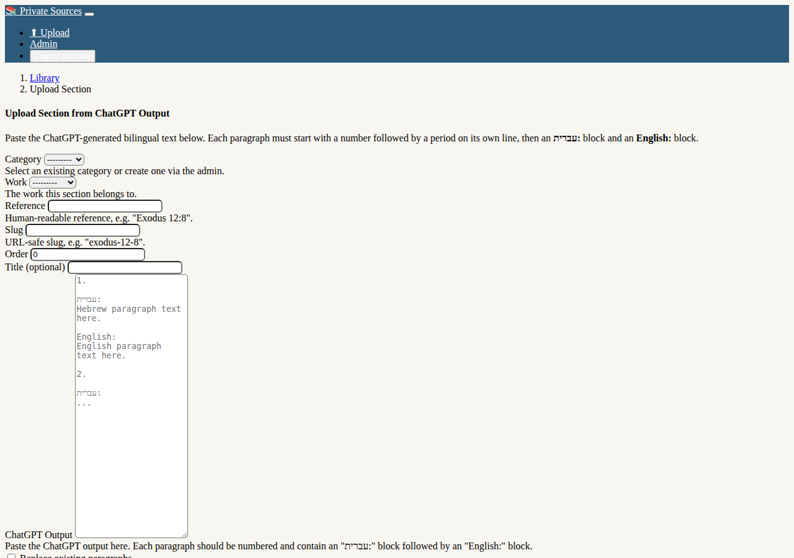

# 📚 Private Sources

A Django web application for storing and browsing bilingual (Hebrew / English) classical Jewish texts, powered by [Sefaria](https://www.sefaria.org/) data and ChatGPT-assisted translation.



---

## Table of Contents

- [Description](#description)
- [Features](#features)
- [Screenshots](#screenshots)
- [Installation](#installation)
- [Usage](#usage)
- [Deployment](#deployment)

---

## Description

**Private Sources** lets you build a personal digital library of classical Jewish texts with parallel Hebrew and English translations. You can organise texts into **categories** and **works**, then browse individual **sections** paragraph-by-paragraph in a clean bilingual layout.

New sections are added by pasting the output of a ChatGPT prompt into the built-in upload form. The app parses the numbered paragraphs automatically and stores them in the database.

---

## Features

- 📖 Browse texts organised by **Category → Work → Section**
- 🔤 Side-by-side **Hebrew (RTL) / English (LTR)** paragraph view
- ⬆ **Upload** new sections by pasting ChatGPT bilingual output
- ⬅ ➡ **Previous / Next** navigation between sections of a work
- 🔒 Upload restricted to **authenticated users**
- 🛠 Full **Django admin** interface for managing all content
- 📱 Responsive **Bootstrap 5** design

---

## Screenshots

### Library — homepage

Browse all categories at a glance.


### Category view

See all works in a category.



### Work view

List of sections within a work.



### Bilingual section reader

Read Hebrew and English paragraphs side by side.



### Upload form

Paste ChatGPT output to add a new section in seconds.



---

## Installation

### Prerequisites

- Python 3.10 or newer
- `pip` and `venv` (included with Python)

### Steps

```bash
# 1. Clone the repository
git clone https://github.com/binyominzeev/private-sources.git
cd private-sources

# 2. Create and activate a virtual environment
python -m venv venv
source venv/bin/activate        # Windows: venv\Scripts\activate

# 3. Install dependencies
pip install -r requirements.txt

# 4. Apply database migrations
python manage.py migrate

# 5. Create an admin account
python manage.py createsuperuser

# 6. Start the development server
python manage.py runserver
```

Open **http://localhost:8000/** in your browser.  
The admin panel is at **http://localhost:8000/admin/**.

---

## Usage

### Browsing texts

1. Visit the homepage to see all **categories**.
2. Click a category to see its **works**.
3. Click a work to see its **sections**.
4. Click a section to read the bilingual **paragraphs**.
5. Use the **← Prev** / **Next →** buttons to move between sections.

### Adding content via the admin

1. Log in at `/admin/`.
2. Create a **Category** (e.g. *Torah*).
3. Create a **Work** inside that category (e.g. *Genesis*).
4. Optionally create **Sections** and **Paragraphs** directly.

### Uploading a section from ChatGPT

1. Ask ChatGPT to translate a passage and format the output like this:

   ```
   1.

   עברית:
   Hebrew text of paragraph one.

   English:
   English translation of paragraph one.

   2.

   עברית:
   Hebrew text of paragraph two.

   English:
   English translation of paragraph two.
   ```

2. Log in and click **⬆ Upload** in the navbar (or visit `/upload/`).
3. Select the **Category**, **Work**, and enter the **Reference** and **Slug**.
4. Paste the ChatGPT output into the text area.
5. Click **Upload & Parse** — the paragraphs are saved immediately.

---

## Deployment

### Environment variables

Override these in your production environment (e.g. in a `.env` file loaded by your process manager):

| Variable | Default | Description |
|---|---|---|
| `DJANGO_SECRET_KEY` | *(insecure default)* | Django secret key — **must** be changed in production |
| `DJANGO_DEBUG` | `True` | Set to `False` in production |
| `DJANGO_ALLOWED_HOSTS` | `localhost 127.0.0.1` | Space-separated list of allowed host names |

### Production checklist

```bash
# Collect static files
python manage.py collectstatic

# Run with a production WSGI server (example: gunicorn)
pip install gunicorn
gunicorn private_sources.wsgi:application --bind 0.0.0.0:8000
```

- **Database**: SQLite works fine for a personal library. For higher traffic, switch to PostgreSQL or MySQL in `private_sources/settings.py`.
- **Static files**: Serve the `staticfiles/` directory via Nginx or a CDN.
- **HTTPS**: Use a reverse proxy (Nginx / Caddy) with a TLS certificate from Let's Encrypt.

### Example Nginx configuration

```nginx
server {
    listen 80;
    server_name yourdomain.com;
    return 301 https://$host$request_uri;
}

server {
    listen 443 ssl;
    server_name yourdomain.com;

    ssl_certificate     /etc/letsencrypt/live/yourdomain.com/fullchain.pem;
    ssl_certificate_key /etc/letsencrypt/live/yourdomain.com/privkey.pem;

    location /static/ {
        alias /path/to/private-sources/staticfiles/;
    }

    location / {
        proxy_pass http://127.0.0.1:8000;
        proxy_set_header Host $host;
        proxy_set_header X-Forwarded-For $proxy_add_x_forwarded_for;
        proxy_set_header X-Forwarded-Proto $scheme;
    }
}
```
